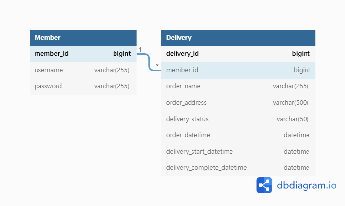

### 요구사항 해석

--- 
- 요구사항에서 ***사용자***라고 말한 부분은 ***배달원***으로 인지했습니다.
- ***전제조건4에서의 사용자***는 ***배달을 요청한 고객***이라고 인지했습니다.
- ***전제조건4-2에서 "사용자가 변경 가능한 배달인 경우에만 수정이 가능합니다."*** 라는 요구사항으로 인해 ***배달이 완료된 상태이면 주소지를 변경할 수 없다***고 생각했습니다. 

### 실행

---
* instellij에서 import하여 실행 가능합니다.
* swagger: http://localhost:8080/swagger-ui/
  * REST API 명세서
* h2-console: http://localhost:8080/h2-console
  * 아이디 : sa
  * 데이터 베이스 정보 확인 가능

### 사용 기술

---

* database
  * h2
  * jpa
* security
  * spring-security
    * PasswordEncoder를 사용을 위함
  * jwt
* util
  * lombok
  * swagger
    * REST API 명세서


### ERD

---



* 회원은 여러 배달 주문을 받을 수 있는 1 : N 구조입니다.
* 주문자의 이름과 주소를 확인할 수 있습니다.
* 유저는 현재 배달 상태를 변경할 수 있습니다.
* 유저는 배달 주문 시간, 배달 시작 시간, 배달 완료 시간을 확인할 수 있습니다.

### 초기 데이터 SET

---

* 회원 SET

|username|password|
|:---------|:-----------|
|배달원1|1a2b3c4d5e6rAA|
|배달원2|1a2b3c4d5e6rAAD|
  
* 배달 SET
  * 배달원1과 배달원2는 각각 50개의 배달 주문 리스트를 가지고 있습니다.

### 프로젝트 구조

--- 

```text
├─src
│  ├─main
│  │  ├─java
│  │  │  └─com
│  │  │      └─example
│  │  │          └─barogo
│  │  │              ├─authorization
│  │  │              ├─configuration
│  │  │              ├─delivery
│  │  │              ├─exception
│  │  │              └─member
│  │  └─resources
│  │      ├─static
│  │      └─templates
│  └─test
```
* authorization
  * 권한에 대한 패키지
* configuration
  * 기본 설정 파일에 대한 패키지
* delivery
  * 배달 관련 패키지
* exception
  * 전체적인 예외 명세와 예외 처리 관련 패키지
* member
  * 유저 관련 패키지
* test
  * 테스트 케이스 작성
  
### API 구조
* [AuthorizationArgumentResolver.java](https://github.com/yhnoh/barogo-repository/blob/master/src/main/java/com/example/barogo/authorization/AuthorizationArgumentResolver.java)
  * JWT토큰을 활용하여 권한을 체크합니다.
  * [Authorization.java](https://github.com/yhnoh/barogo-repository/blob/master/src/main/java/com/example/barogo/authorization/Authorization.java) 에서 required 필드를 활용하여 필수데이터로 선정할지 말지를 결정합니다.
  ```java
    ...
    //컨트롤러
    @GetMapping("")
    public 리턴타입 memberDeliveries(@Authorization(required = true) Member member){
    ...
    }
  ``` 
* [ApiResponse.java](https://github.com/yhnoh/barogo-repository/blob/master/src/main/java/com/example/barogo/ApiResponse.java)
  * 성공/실패 응답에 대한 형식이 지정되어 있습니다.
* [GlobalExceptionHandler.java](https://github.com/yhnoh/barogo-repository/blob/master/src/main/java/com/example/barogo/exception/GlobalExceptionHandler.java)
  * 예외에 대해 어떻게 응답할지를 결정합니다.
* [DefaultMemberService.java](https://github.com/yhnoh/barogo-repository/blob/master/src/main/java/com/example/barogo/member/service/DefaultMemberService.java)
  * DefaultMemberService는 기본적인 회원가입과 로그인을 담당합니다.
  * 인터페이스를 상속받아 구현해 두었기 때문에 언제든지 다른 회원가입 방식 및 로그인 방식으로 변경이 가능합니다.
* [JwtMemberService.java](https://github.com/yhnoh/barogo-repository/blob/master/src/main/java/com/example/barogo/member/service/JwtMemberService.java)
  * JwtMemberService는 JWT를 활용한 회원가입과 로그인을 담당합니다.
* [DeliveryService.java](https://github.com/yhnoh/barogo-repository/blob/master/src/main/java/com/example/barogo/delivery/service/DeliveryService.java)
  * 배달의 주소 변경 및 배달원 자신의 주문 리스트의 기능을 구현해두었습니다. 